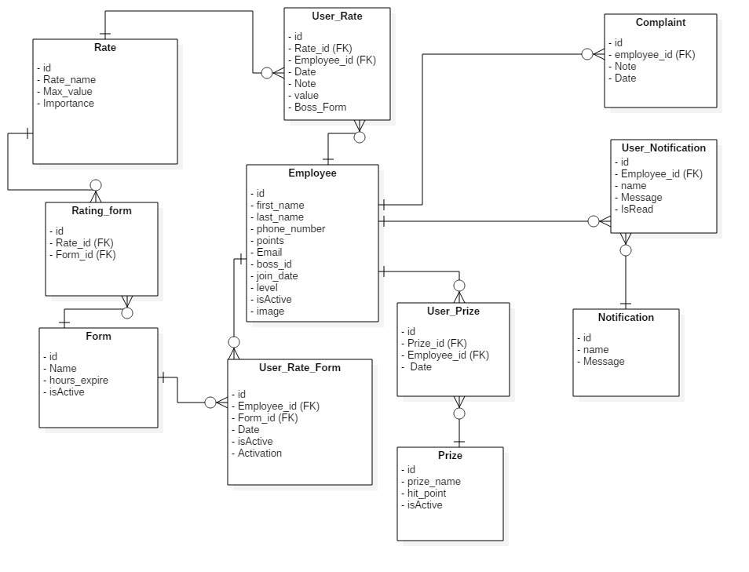

# Incentive system

In this project we create a Incenetive system,which we can use it in any company.

The incentive word means to **motivate** and encourage, by motivating people in any industry you get the best of them

You can incentive a child with some candies to make him acts well or to make him study hard.

And that is the human nature, each act we do we like to get a reward for it, whether compliment on their acts or by giving them some physics **trophy**.

If the **employees** doesn't feel good about his job or find that he doesn’t pay well, doesn’t feel **justice** and doesn’t feel that his job appreciate.

Then they will works like a machine without soul, without any motivation to make them work better or any try to improve themself. 

So if you remove those negative emotions and inject a positive one then you will get a better job, more healthy and enthusiastic employees.

By give a reword to employees how works hard and who try to give 100% of their energy and  punish how doesn’t.
In this way everyone will works as he can because there is no unfairness there is no one doesn’t take his absolute rights and each minute the employees spend to make the industry better they will be paid for it.
So we try to do that by creating an incentive system which could be used by any company from any industry.


#  How dose this System Looks?

Its **web system** using **Django** framework for backend and HTML, CSS, javascript for Frontend  
we using a **Tree** structure to represent the **Hierarchy** of the company.
So in this way, we can use it for a small restaurant or information technology company.
And now we will explains how our system work 

This is an image show The ERD to the system.


# How dose The system works ?
We are using a **Rating system** or **Point system**, which means that every employee has some point which replaces by a trophy determine by the management.

The system manager can **add, delete, Edit** any type of Rating he wants.

And each rating has value and importance to determine how this rating will be treated.

For example:
        
        The Cod rating has importance 10 
        while the Time commitment is only 3

The **importance** is very important Factor because we are using an **weighted average** to compute the complete point for each employee

$POINT=\frac{∑_i (VALUE_i X IMPORTANC_i)}{∑_i IMPORTANCE_i}$

In this way if the employee doesn’t keeping on his rank he will lose a lot of points, on the other hand, if he get HI rate he well get a lot of points.

As we say, the system administrator can edit or add any type of rate.
He also can add, edit, delete, any type of trophy.

Each Trophy has value and HitPoint the manager determine these two value when he add the trophy and this two factor determine how much this trophy is important and how much we should work to deserve it.

For example:

    Europe Trip needs 100 points to get.
    
# who give Points ?
As we show that  The system structure to represent the Hierarchy of the organization is **Tree** structure.
So each employee connects with his Supervisor and His team.
So each employee has a team who can **rate them**.
Each **supervisor can rate and only rate the employee that is directly underneath**.
Each employee can see the progress he gets and the progress of all employees in same Level, which means all employees how  have the same experience and of course the Teams progress.

# How do we Schedule The Rating operation

Each **month** the system **administrator** sends a **Rating Form** for all supervisors or for each employee has team to rate them.

The system administrator can **create any type of Rating Form** he wants and send one for each supervisor, so the supervisors could rating deferent things according to their specialist.

For example :

        AI: may contain math, Algorithm, Time, python
        Network: coding, Time 
        
        
# What if There is a bias Boss?
If your boss prefers some employee among you and you feel **unfair** about his rating.
You can send a **complaint** to HR from your account and explain why you feel unjustice and if you have right I hope you will get it.
And if any **Supervisor don’t rate** all members of his team he will get **punished** by losing some points and if he dose he will get a reward for it.


# How to Run This project 
you can whatch this video :[Source link](https://drive.google.com/drive/folders/1OrTKYRa5Csk053V8Zrd9T7ATH4KgRTfn?usp=sharing)

install the project from Github

and also install static.zip from this link :[Source link](https://drive.google.com/drive/folders/1OrTKYRa5Csk053V8Zrd9T7ATH4KgRTfn?usp=sharing)
and decompres it and put it in the project folder. 

install **Django** using pip 


```python
$pip install Django
```

now you need to move to the project directory and run the server


```python
$cd Rating_system
$python manage.py runserver
```

and now you can open the browser and check the system 
The admin account is 


```python
username=khalil
password=123456kha
```

Authors : [khalil hennara](https://github.com/khalil-Hennara),khalied Tofilea


```python

```


